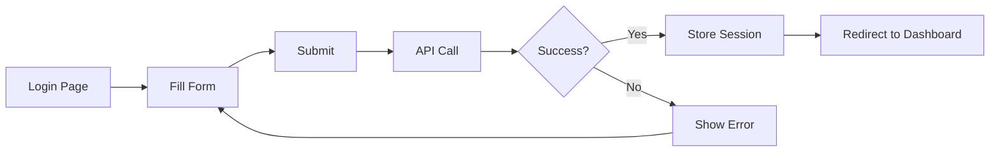
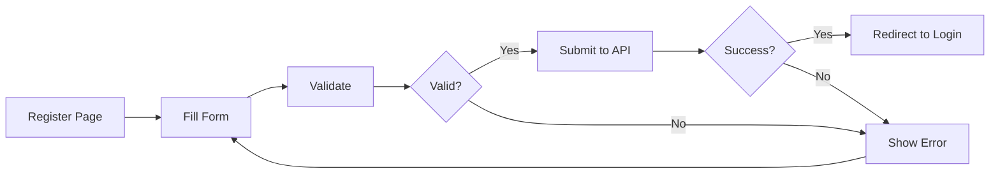
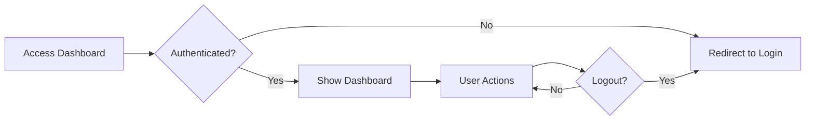

# Authentication Routes Documentation

This document describes the authentication routes and pages created in the admin-ui Next.js application.

## Overview

All authentication routes are located under `/[lang]/auth/` to support internationalization. The authentication flow uses the `@gql-cms/auth-ui` component library for consistent UI and behavior.

## Routes Structure

```
apps/admin-ui/src/app/
├── [lang]/
│   ├── auth/
│   │   ├── layout.tsx                  # Auth layout (centered, minimal)
│   │   ├── auth-layout.module.css      # Layout styles
│   │   ├── auth-page.module.css        # Shared page styles
│   │   ├── login/
│   │   │   └── page.tsx               # Login page with LoginController
│   │   ├── register/
│   │   │   └── page.tsx               # Registration page
│   │   └── forgot-password/
│   │       └── page.tsx               # Password reset request
│   └── dashboard/
│       ├── page.tsx                    # Protected dashboard page
│       └── dashboard.module.css        # Dashboard styles
```

## Authentication Pages

### 1. Login Page (`/en/auth/login`)

**Component:** Uses `LoginController` from `@gql-cms/auth-ui`

**Features:**
- Email and password authentication
- Password visibility toggle
- Form validation
- Error handling
- Loading states
- Keyboard navigation support
- Redirects to dashboard on success

**API Endpoint:** `POST /northwind/auth/login`

**Usage:**
```typescript
<LoginController
  apiBaseUrl="/northwind/auth"
  onLoginSuccess={handleLoginSuccess}
  onLoginError={handleLoginError}
/>
```

### 2. Register Page (`/en/auth/register`)

**Features:**
- User registration with email and password
- Optional display name field
- Password confirmation
- Password strength validation (min 8 characters)
- Form validation
- Error handling
- Redirects to login on success

**API Endpoint:** `POST /northwind/auth/register`

**Form Fields:**
- Display Name (optional)
- Email Address (required)
- Password (required, min 8 chars)
- Confirm Password (required)

### 3. Forgot Password Page (`/en/auth/forgot-password`)

**Features:**
- Password reset email request
- Email validation
- Success feedback
- Auto-redirect to login after success
- Simple, focused UI

**API Endpoint:** `POST /northwind/auth/forgot-password` (TODO: implement)

**Note:** Currently simulates the API call. Backend implementation needed.

### 4. Dashboard Page (`/en/dashboard`)

**Features:**
- Protected route (requires authentication)
- Displays user information
- Quick navigation links
- Logout functionality
- Session management

**Authentication Check:**
```typescript
useEffect(() => {
  const userData = sessionStorage.getItem('user');
  if (!userData) {
    router.push('/en/auth/login');
  }
}, [router]);
```

## Layouts

### Auth Layout

**Purpose:** Minimal, centered layout for authentication pages

**Features:**
- Full-height viewport
- Centered content
- Gradient background
- No navigation or headers
- Responsive design

**Usage:** Automatically applied to all pages under `/[lang]/auth/`

### Shared Styles

All auth pages use consistent styling from `auth-page.module.css`:
- Consistent card design
- Unified form styles
- Matching button styles
- Consistent error/success messages
- Responsive layout

## Authentication Flow

### Successful Login Flow



### Registration Flow



### Protected Route Access



## E2E Tests

Comprehensive Playwright tests are located in `apps/admin-ui-e2e/src/auth/`:

### Test Files

1. **`login.spec.ts`** (10 tests)
   - Form rendering and validation
   - Password visibility toggle
   - Loading states
   - Error handling
   - Keyboard navigation
   - Successful login flow

2. **`register.spec.ts`** (10 tests)
   - Form rendering
   - Password matching validation
   - Password length validation
   - Optional display name
   - Successful registration
   - Error handling

3. **`forgot-password.spec.ts`** (8 tests)
   - Form rendering
   - Email validation
   - Success message
   - Auto-redirect
   - Form disabling after success

4. **`dashboard.spec.ts`** (8 tests)
   - Authentication check
   - Content rendering
   - User information display
   - Navigation links
   - Logout functionality

5. **`auth-flow.spec.ts`** (7 tests)
   - Complete registration → login flow
   - Login → dashboard → logout flow
   - Forgot password → login flow
   - Navigation between auth pages
   - Edge cases and error scenarios

### Running E2E Tests

```bash
# Run all e2e tests
npx nx e2e admin-ui-e2e

# Run specific auth tests
npx nx e2e admin-ui-e2e --grep="Login Page"
npx nx e2e admin-ui-e2e --grep="Register Page"
npx nx e2e admin-ui-e2e --grep="Dashboard"

# Run with UI
npx nx e2e admin-ui-e2e --ui

# Debug mode
npx nx e2e admin-ui-e2e --debug
```

## API Integration

### Authentication Endpoints

All authentication routes connect to the Northwind ACL authentication system:

- **Login:** `POST /northwind/auth/login`
- **Register:** `POST /northwind/auth/register`
- **Logout:** `POST /northwind/auth/logout`
- **Refresh:** `POST /northwind/auth/refresh`
- **Me:** `GET /northwind/auth/me`

### Request Format

**Login Request:**
```json
{
  "email": "user@example.com",
  "password": "password123"
}
```

**Register Request:**
```json
{
  "email": "user@example.com",
  "password": "password123",
  "displayName": "John Doe",
  "kind": "customer"
}
```

### Response Format

**Success Response:**
```json
{
  "success": true,
  "message": "Login successful",
  "principal": {
    "id": "123e4567-e89b-12d3-a456-426614174000",
    "email": "user@example.com",
    "kind": "customer",
    "displayName": "John Doe",
    "emailVerified": true
  }
}
```

**Error Response:**
```json
{
  "success": false,
  "message": "Invalid credentials"
}
```

### Session Management

Authentication uses HTTP-only cookies:
- `access_token` - Short-lived access token (15 minutes)
- `refresh_token` - Long-lived refresh token (30 days)

Session data is also stored in `sessionStorage` for client-side checks:
```typescript
sessionStorage.setItem('user', JSON.stringify(principal));
```

## Development

### Running the App

```bash
# Start development server
npx nx serve admin-ui

# Access auth pages
# http://localhost:4200/en/auth/login
# http://localhost:4200/en/auth/register
# http://localhost:4200/en/auth/forgot-password
# http://localhost:4200/en/dashboard
```

### Building

```bash
# Build the app
npx nx build admin-ui

# Run production build
npm run start
```

## Customization

### Adding New Auth Pages

1. Create page in `src/app/[lang]/auth/`
2. Use auth layout (automatic)
3. Use shared styles from `auth-page.module.css`
4. Add e2e tests in `apps/admin-ui-e2e/src/auth/`

### Modifying Layout

Edit `src/app/[lang]/auth/layout.tsx` to change:
- Background color/gradient
- Container width
- Padding/spacing

### Changing Redirect Behavior

Edit page-level `onLoginSuccess` callbacks:
```typescript
const handleLoginSuccess = (principal: LoginSuccessData) => {
  // Custom redirect logic
  router.push('/custom/path');
};
```

## Security Considerations

1. **Password Requirements:**
   - Minimum 8 characters
   - Client-side validation
   - Server-side validation required

2. **Session Storage:**
   - User data in `sessionStorage` (cleared on tab close)
   - Cookies for API authentication
   - No sensitive data in localStorage

3. **Protected Routes:**
   - Client-side auth check
   - Server-side validation required
   - Implement middleware for production

4. **CSRF Protection:**
   - Use `credentials: 'include'`
   - Cookies have `sameSite` attribute
   - Backend CSRF tokens recommended

## TODO

- [ ] Implement password reset backend endpoint
- [ ] Add email verification flow
- [ ] Implement OAuth providers (Google, GitHub)
- [ ] Add "Remember Me" functionality
- [ ] Implement session timeout warnings
- [ ] Add 2FA support
- [ ] Create password strength meter
- [ ] Add rate limiting feedback
- [ ] Implement account recovery flow
- [ ] Add user settings page

## Resources

- [NextJS Authentication](https://nextjs.org/docs/authentication)
- [Playwright Testing](https://playwright.dev/)
- [@gql-cms/auth-ui Library](../../lib/auth-ui/README.md)
- [Northwind Auth API](../../docs/ACL.md)

## Summary

✅ **4 Authentication Pages** created (Login, Register, Forgot Password, Dashboard)
✅ **43 E2E Tests** covering all auth flows
✅ **Consistent Layout** using shared components and styles
✅ **Full Integration** with Northwind auth API
✅ **Accessible Forms** with proper ARIA labels
✅ **Responsive Design** works on mobile and desktop
✅ **Error Handling** for all failure scenarios
✅ **Loading States** for better UX

---

**Created:** November 2, 2025
**Status:** ✅ Complete and Ready for Testing
